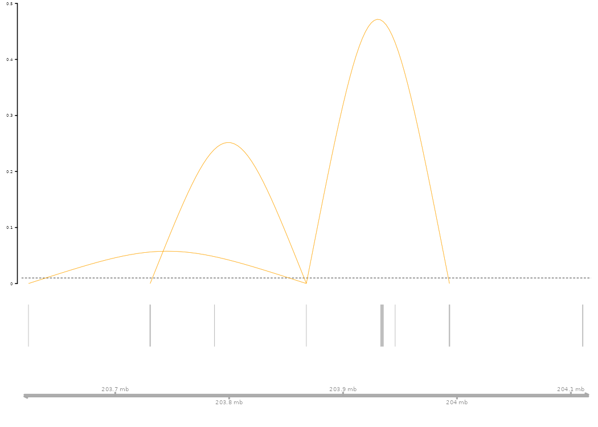
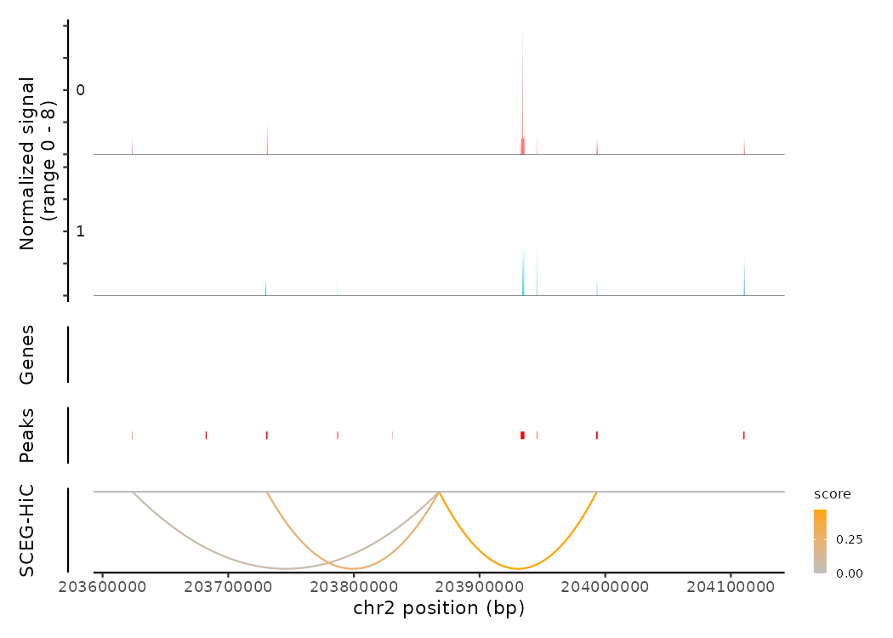

<!-- README.md is generated from README.Rmd. Please edit that file -->

# SCEG-HiC (Predicting enhancer-gene links from single-cell multi-omics data by integrating prior Hi-C information)

<!-- badges: start -->

<!-- badges: end -->

## Overview

SCEG-HiC predicts enhancer–gene links by integrating multi-omics
single-cell data (either paired scATAC-seq/RNA-seq or scATAC-seq alone)
with three-dimensional chromatin conformation information derived from
bulk average Hi-C data. It employs the weighted graphical lasso
(wglasso) model to incorporate average bulk Hi-C data, effectively
regularizing the correlation matrix with the prior Hi-C contact matrix
as a penalty term.

## Installation

### Required software

SCEG-HiC runs in the [R statistical computing
environment](https://www.r-project.org/). It requires R version 4.1.0 or
higher, [Bioconductor](https://bioconductor.org/) version 3.14 or
higher, and Seurat 4.0 or higher to access the latest features.

To install Bioconductor, open an R session and run:

``` r
if (!requireNamespace("BiocManager", quietly = TRUE))
    install.packages("BiocManager")
BiocManager::install(version = "3.14")
```

Next, install a few Bioconductor packages that are not installed
automatically:

``` r
BiocManager::install(c(
  'BiocGenerics', 'DelayedArray', 'DelayedMatrixStats',
  'limma', 'lme4', 'S4Vectors', 'SingleCellExperiment',
  'SummarizedExperiment', 'batchelor', 'HDF5Array',
  'terra', 'ggrastr', 'Gviz', 'rtracklayer', 'GenomeInfoDb', 'GenomicRanges'
))
```

Installation of other dependencies

- Install the Signac pacakge:
  `devtools::install_github("timoast/signac", ref = "develop")`. If you
  encounter any issues, please check the [Signac
  documentation](https://stuartlab.org/signac/).
- Install the Cicero package:
  `devtools::install_github("cole-trapnell-lab/cicero-release", ref = "monocle3")`.
  If you encounter any issues, please check the [Cicero installation
  guide](https://cole-trapnell-lab.github.io/cicero-release/docs_m3/#installing-cicero).

Now, you can install the development version of SCEG-HiC from
[GitHub](https://github.com/) with:

``` r
# If you haven't installed devtools yet, uncomment and run:
# install.packages("devtools")

# Install the development version of SCEG-HiC from GitHub
devtools::install_github("wuwei77lx/SCEGHiC")
```

If you prefer the stable release version from CRAN, run:

``` r
# Install the released version from CRAN
install.packages("SCEGHiC")
```

### Testing the installation

To verify that SCEG-HiC installed correctly, start a new R session and
run:

``` r
library(SCEGHiC)
```

If no errors appear, the package is successfully loaded and ready to
use.

## Quickstart

This basic example demonstrates how to analyze paired scATAC-seq/RNA-seq
data using SCEG-HiC:

``` r
library(SCEGHiC)
library(Signac)

# Load example multi-omics dataset
data(multiomic_small)

# Preprocess the data (aggregation)
SCEGdata <- process_data(multiomic_small, k_neigh = 5, max_overlap = 0.5)
#> Generating aggregated data
#> Aggregating cluster 0
#> Sample cells randomly.
#> There are 11 samples
#> Aggregating cluster 1
#> Sample cells randomly.
#> There are 11 samples

# Define genes of interest
gene <- c("TRABD2A", "GNLY", "MFSD6", "CTLA4", "LCLAT1", "NCK2", "GALM", "TMSB10", "ID2", "CXCR4")

# Get path to example average Hi-C data
fpath <- system.file("extdata", package = "SCEGHiC")

# Calculate Hi-C based weights for enhancer-gene pairs
weight <- calculateHiCWeights(SCEGdata, species = "Homo sapiens", genome = "hg38", focus_gene = gene, averHicPath = fpath)
#> Processing chromosome chr2...
#> Found 10 TSS loci on chr2.
#> Calculating Hi-C weights for gene TRABD2A...
#> Calculating Hi-C weights for gene GNLY...
#> Calculating Hi-C weights for gene MFSD6...
#> Calculating Hi-C weights for gene CXCR4...
#> Calculating Hi-C weights for gene CTLA4...
#> Calculating Hi-C weights for gene LCLAT1...
#> Calculating Hi-C weights for gene NCK2...
#> Calculating Hi-C weights for gene ID2...
#> Calculating Hi-C weights for gene GALM...
#> Calculating Hi-C weights for gene TMSB10...
#> Finished calculating Hi-C weights for all genes.

# Run the SCEG-HiC model
results_SCEGHiC <- Run_SCEG_HiC(SCEGdata, weight, focus_gene = gene)
#> Total predicted genes: 10
#> Running model for gene: TRABD2A
#> [1] "The optimal penalty parameter (rho) selected by BIC is: 0.43"
#> Running model for gene: GNLY
#> [1] "The optimal penalty parameter (rho) selected by BIC is: 0.19"
#> Running model for gene: MFSD6
#> [1] "The optimal penalty parameter (rho) selected by BIC is: 0.22"
#> Running model for gene: CXCR4
#> [1] "The optimal penalty parameter (rho) selected by BIC is: 0.14"
#> Running model for gene: CTLA4
#> [1] "The optimal penalty parameter (rho) selected by BIC is: 0.17"
#> Running model for gene: LCLAT1
#> [1] "The optimal penalty parameter (rho) selected by BIC is: 0.41"
#> Running model for gene: NCK2
#> [1] "The optimal penalty parameter (rho) selected by BIC is: 0.25"
#> Running model for gene: ID2
#> [1] "The optimal penalty parameter (rho) selected by BIC is: 0.13"
#> Running model for gene: GALM
#> [1] "The optimal penalty parameter (rho) selected by BIC is: 0.11"
#> Running model for gene: TMSB10
#> [1] "The optimal penalty parameter (rho) selected by BIC is: 0.44"

# Arc plot visualization predicted enhancer-gene links for CTLA4
connections_Plot(results_SCEGHiC, species = "Homo sapiens", genome = "hg38", focus_gene = "CTLA4", cutoff = 0.01, gene_anno = NULL)
```



``` r
# Load fragment data for coverage plotting
frag_path <- system.file("extdata", "multiomic_small_atac_fragments.tsv.gz", package = "SCEGHiC")
frags <- CreateFragmentObject(path = frag_path, cells = colnames(multiomic_small))
#> Computing hash
Fragments(multiomic_small) <- frags

# Coverage plot and visualize the links of CTLA4
coverPlot(multiomic_small, focus_gene = "CTLA4", species = "Homo sapiens", genome = "hg38",
          assay = "peaks", SCEG_HiC_Result = results_SCEGHiC, SCEG_HiC_cutoff = 0.01)
#> Warning in .merge_two_Seqinfo_objects(x, y): The 2 combined objects have no sequence levels in common. (Use
#>   suppressWarnings() to suppress this warning.)
```



<details>

<summary>

**Session Info**
</summary>

``` r
sessionInfo()
#> R version 4.4.2 (2024-10-31)
#> Platform: x86_64-conda-linux-gnu
#> Running under: Rocky Linux 9.6 (Blue Onyx)
#> 
#> Matrix products: default
#> BLAS/LAPACK: /home/liangxuan/conda/envs/test/lib/libopenblasp-r0.3.28.so;  LAPACK version 3.12.0
#> 
#> locale:
#>  [1] LC_CTYPE=en_US.UTF-8       LC_NUMERIC=C              
#>  [3] LC_TIME=en_US.UTF-8        LC_COLLATE=en_US.UTF-8    
#>  [5] LC_MONETARY=en_US.UTF-8    LC_MESSAGES=en_US.UTF-8   
#>  [7] LC_PAPER=en_US.UTF-8       LC_NAME=C                 
#>  [9] LC_ADDRESS=C               LC_TELEPHONE=C            
#> [11] LC_MEASUREMENT=en_US.UTF-8 LC_IDENTIFICATION=C       
#> 
#> time zone: Asia/Shanghai
#> tzcode source: system (glibc)
#> 
#> attached base packages:
#> [1] stats4    stats     graphics  grDevices utils     datasets  methods  
#> [8] base     
#> 
#> other attached packages:
#>  [1] harmony_1.2.3                     Rcpp_1.0.14                      
#>  [3] Matrix_1.6-5                      dplyr_1.1.4                      
#>  [5] EnsDb.Mmusculus.v79_2.99.0        SeuratDisk_0.0.0.9021            
#>  [7] hdf5r_1.3.12                      ggplot2_3.5.1                    
#>  [9] BSgenome.Hsapiens.UCSC.hg38_1.4.5 BSgenome_1.74.0                  
#> [11] rtracklayer_1.66.0                BiocIO_1.16.0                    
#> [13] Biostrings_2.74.1                 XVector_0.46.0                   
#> [15] EnsDb.Hsapiens.v86_2.99.0         ensembldb_2.30.0                 
#> [17] AnnotationFilter_1.30.0           GenomicFeatures_1.58.0           
#> [19] AnnotationDbi_1.68.0              Biobase_2.66.0                   
#> [21] GenomicRanges_1.58.0              GenomeInfoDb_1.42.1              
#> [23] IRanges_2.40.1                    S4Vectors_0.44.0                 
#> [25] BiocGenerics_0.52.0               Seurat_5.2.0                     
#> [27] SeuratObject_5.0.2                sp_2.1-4                         
#> [29] Signac_1.14.9001                  SCEGHiC_0.0.0.9000               
#> 
#> loaded via a namespace (and not attached):
#>   [1] fs_1.6.5                    ProtGenerics_1.38.0        
#>   [3] matrixStats_1.5.0           spatstat.sparse_3.1-0      
#>   [5] bitops_1.0-9                httr_1.4.7                 
#>   [7] RColorBrewer_1.1-3          tools_4.4.2                
#>   [9] sctransform_0.4.1           backports_1.5.0            
#>  [11] R6_2.5.1                    lazyeval_0.2.2             
#>  [13] uwot_0.2.2                  Gviz_1.50.0                
#>  [15] cicero_1.3.9                withr_3.0.2                
#>  [17] prettyunits_1.2.0           gridExtra_2.3              
#>  [19] progressr_0.15.1            textshaping_1.0.1          
#>  [21] cli_3.6.3                   spatstat.explore_3.3-4     
#>  [23] fastDummies_1.7.4           sass_0.4.9                 
#>  [25] labeling_0.4.3              slam_0.1-55                
#>  [27] spatstat.data_3.1-4         ggridges_0.5.6             
#>  [29] pbapply_1.7-2               systemfonts_1.1.0          
#>  [31] Rsamtools_2.22.0            foreign_0.8-88             
#>  [33] R.utils_2.12.3              dichromat_2.0-0.1          
#>  [35] parallelly_1.41.0           VGAM_1.1-12                
#>  [37] rstudioapi_0.17.1           RSQLite_2.3.9              
#>  [39] FNN_1.1.4.1                 generics_0.1.3             
#>  [41] ica_1.0-3                   spatstat.random_3.3-2      
#>  [43] interp_1.1-6                ggbeeswarm_0.7.2           
#>  [45] abind_1.4-8                 R.methodsS3_1.8.2          
#>  [47] lifecycle_1.0.4             yaml_2.3.10                
#>  [49] SummarizedExperiment_1.36.0 SparseArray_1.6.0          
#>  [51] BiocFileCache_2.14.0        Rtsne_0.17                 
#>  [53] grid_4.4.2                  blob_1.2.4                 
#>  [55] promises_1.3.2              crayon_1.5.3               
#>  [57] miniUI_0.1.1.1              lattice_0.22-6             
#>  [59] cowplot_1.1.3               KEGGREST_1.46.0            
#>  [61] pillar_1.10.1               knitr_1.49                 
#>  [63] boot_1.3-31                 rjson_0.2.23               
#>  [65] future.apply_1.11.3         codetools_0.2-20           
#>  [67] fastmatch_1.1-6             glue_1.8.0                 
#>  [69] spatstat.univar_3.1-1       data.table_1.16.4          
#>  [71] Rdpack_2.6.2                vctrs_0.6.5                
#>  [73] png_0.1-8                   spam_2.11-0                
#>  [75] gtable_0.3.6                assertthat_0.2.1           
#>  [77] cachem_1.1.0                xfun_0.50                  
#>  [79] rbibutils_2.3               S4Arrays_1.6.0             
#>  [81] mime_0.12                   reformulas_0.4.0           
#>  [83] survival_3.8-3              SingleCellExperiment_1.28.1
#>  [85] RcppRoll_0.3.1              fitdistrplus_1.2-2         
#>  [87] ROCR_1.0-11                 nlme_3.1-166               
#>  [89] usethis_3.1.0               bit64_4.5.2                
#>  [91] progress_1.2.3              filelock_1.0.3             
#>  [93] RcppAnnoy_0.0.22            rprojroot_2.0.4            
#>  [95] bslib_0.8.0                 irlba_2.3.5.1              
#>  [97] vipor_0.4.7                 KernSmooth_2.23-26         
#>  [99] rpart_4.1.24                colorspace_2.1-1           
#> [101] DBI_1.2.3                   Hmisc_5.2-2                
#> [103] nnet_7.3-20                 ggrastr_1.0.2              
#> [105] tidyselect_1.2.1            bit_4.5.0.1                
#> [107] compiler_4.4.2              curl_6.0.1                 
#> [109] httr2_1.0.7                 htmlTable_2.4.3            
#> [111] xml2_1.5.0                  desc_1.4.3                 
#> [113] DelayedArray_0.32.0         plotly_4.10.4              
#> [115] checkmate_2.3.2             scales_1.4.0               
#> [117] lmtest_0.9-40               rappdirs_0.3.3             
#> [119] stringr_1.5.1               digest_0.6.37              
#> [121] goftest_1.2-3               minqa_1.2.8                
#> [123] spatstat.utils_3.1-2        reader_1.0.6               
#> [125] rmarkdown_2.29              RhpcBLASctl_0.23-42        
#> [127] htmltools_0.5.8.1           pkgconfig_2.0.3            
#> [129] jpeg_0.1-10                 base64enc_0.1-3            
#> [131] lme4_1.1-36                 MatrixGenerics_1.18.1      
#> [133] dbplyr_2.5.0                fastmap_1.2.0              
#> [135] rlang_1.1.4                 htmlwidgets_1.6.4          
#> [137] UCSC.utils_1.2.0            shiny_1.10.0               
#> [139] jquerylib_0.1.4             farver_2.1.2               
#> [141] zoo_1.8-12                  jsonlite_1.8.9             
#> [143] BiocParallel_1.40.0         R.oo_1.27.0                
#> [145] VariantAnnotation_1.52.0    RCurl_1.98-1.16            
#> [147] magrittr_2.0.3              Formula_1.2-5              
#> [149] GenomeInfoDbData_1.2.13     dotCall64_1.2              
#> [151] patchwork_1.3.0             reticulate_1.40.0          
#> [153] stringi_1.8.7               zlibbioc_1.52.0            
#> [155] MASS_7.3-64                 plyr_1.8.9                 
#> [157] parallel_4.4.2              listenv_0.9.1              
#> [159] ggrepel_0.9.6               deldir_2.0-4               
#> [161] splines_4.4.2               tensor_1.5                 
#> [163] hms_1.1.3                   igraph_2.0.3               
#> [165] spatstat.geom_3.3-4         RcppHNSW_0.6.0             
#> [167] reshape2_1.4.4              biomaRt_2.62.0             
#> [169] XML_3.99-0.17               evaluate_1.0.3             
#> [171] latticeExtra_0.6-30         biovizBase_1.54.0          
#> [173] NCmisc_1.2.0                nloptr_2.1.1               
#> [175] tweenr_2.0.3                httpuv_1.6.15              
#> [177] RANN_2.6.2                  tidyr_1.3.1                
#> [179] purrr_1.0.2                 polyclip_1.10-7            
#> [181] future_1.34.0               scattermore_1.2            
#> [183] ggforce_0.4.2               monocle3_1.3.7             
#> [185] xtable_1.8-4                restfulr_0.0.15            
#> [187] RSpectra_0.16-2             roxygen2_7.3.3             
#> [189] later_1.4.1                 ragg_1.3.3                 
#> [191] glasso_1.11                 viridisLite_0.4.2          
#> [193] tibble_3.2.1                beeswarm_0.4.0             
#> [195] memoise_2.0.1               GenomicAlignments_1.42.0   
#> [197] cluster_2.1.8               globals_0.16.3
```

</details>

See the [documentation website](https://wuwei77lx.github.io/SCEGHiC/)
for more information!

## The bulk average Hi-C data

The human cell types used for averaging are based on [34 Hi-C
datasets](https://www.encodeproject.org/annotations/ENCSR382HAW/) from
the ENCODE project.

The mouse cell types used for averaging are: two embryonic stem cell
types (mESC1, mESC2), CH12LX, CH12F3, fiber, epithelium, and B cells.

The bulk average Hi-C data can be generated using the [Activity by
Contact (ABC)](https://www.nature.com/articles/s41588-019-0538-0)
model’s `makeAverageHiC.py` script.

### Download Links for Average Hi-C Data

- **Human bulk average Hi-C (~54.1 GB)**

  Download from:
  [ENCFF134PUN.bed.gz](https://www.encodeproject.org/files/ENCFF134PUN/@@download/ENCFF134PUN.bed.gz).

After downloading, extract the human bulk average Hi-C using the
[Activity by Contact
(ABC)](https://www.nature.com/articles/s41588-019-0538-0) model’s
`extract_avg_hic.py` script:

``` sh
python code/Hi_C/extract_avg_hic.py --avg_hic_bed_file ../ENCFF134PUN.bed.gz --output_dir ../
```

- **Mouse bulk average Hi-C (~13.9 GB)**

  Download from:
  [10.5281/zenodo.14849886](https://zenodo.org/record/14849886).

For more details about bulk average Hi-C data, please visit:
<https://github.com/wuwei77lx/compare_model>.

## Example

In SCEG-HiC, you can choose either aggregation or single-cell retention
approach:

- **Aggregation approach**: Aggregates binarized scATAC-seq data across
  cell types using k-nearest neighbor smoothing to reduce data sparsity.
  This approach captures a broader spectrum of enhancer-gene links
  across cell types, with slightly reduced prediction accuracy.

- **Single-cell retention approach**: Normalizes scATAC-seq data within
  individual cell types to individual cell signals. This method achieves
  higher precision and accuracy, albeit identifying fewer enhancer-gene
  links

**Recommendation**: To balance accuracy and coverage, we implemented
both preprocessing strategies in SCEG-HiC, with aggregation designated
as the default. The single-cell retention approach can be optionally
used when higher precision within specific cell types is desired.

For more details and real data examples, please visit:

- [SCEG-HiC on paired scATAC-seq/RNA-seq data of PBMC
  (aggregation)](https://wuwei77lx.github.io/SCEGHiC/articles/PBMC_multiomic_aggregation.html)

- [SCEG-HiC on paired scATAC-seq/RNA-seq data of PBMC
  CD4T](https://wuwei77lx.github.io/SCEGHiC/articles/PBMC_multiomic_CD4T.html)

- [SCEG-HiC on paired scATAC-seq/RNA-seq data of mouse skin
  (aggregation)](https://wuwei77lx.github.io/SCEGHiC/articles/mouse_skin_multiomic_aggregation.html)

- [SCEG-HiC on scATAC-seq data alone from human COVID-19
  monocytes](https://wuwei77lx.github.io/SCEGHiC/articles/human_covid_19_scATAC_seq_monocytes.html)

Alternatively, when applying SCEG-HiC to a new tissue, the penalty
strength can be adjusted using the alpha parameter (`alpha * rho`):

- **Increase alpha** is suitable for tissues well represented in the
  datasets used to construct the bulk average Hi-C map, to allow greater
  reliance on prior Hi-C contact information.

- **Decrease alpha** is preferable for more unique tissues or
  conditions, to reduce dependence on prior Hi-C contact information and
  emphasize single-cell data.

``` r
# Example: run SCEG-HiC with scaled penalty
results_SCEGHiC <- Run_SCEG_HiC(SCEGdata, weight, focus_gene = gene, alpha=1.5)
```

**Notes:**

- `alpha = 1` uses the original penalty (default).

- `alpha > 1` strengthens the penalty.

- `alpha < 1`weakens the penalty.

## Help

If you have any questions, comments, or suggestions, please contact Xuan
Liang at <liangxuan2022@sinh.ac.cn>.
