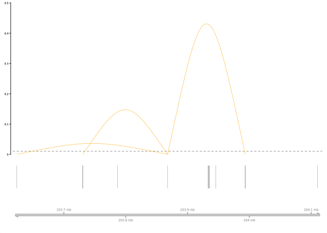
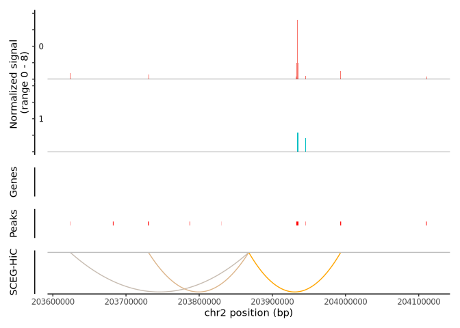

<!-- README.md is generated from README.Rmd. Please edit that file -->

# SCEG-HiC(single-cell enhancer gene interactions by integrating priori Hi-C information)

<!-- badges: start -->

<!-- badges: end -->

## Overview

SCEG-HiC predicts interactions between genes and enhancers using
multi-ome (paired scRNA-seq and scATAC-seq or only scATAC-seq)
sequencing data and three-dimensional omics data (the bulk average
Hi-C). The approach uses weighted graphical lasso (wglasso) model,
taking the average Hi-C data as priori knowledge, to predict cell
specific interactions between genes and enhancers based on the
correlation between genes and enhancers.

## Installation

### Required software

SCEG-HiC runs in the [R statistical computing
environment](https://www.r-project.org/). You will need R version 4.1.0
or higher, [Bioconductor](https://bioconductor.org/) version 3.14 or
higher, and Seurat 4.0 or higher to have access to the latest features.

To install Bioconductor, open R and run:

``` r
if (!requireNamespace("BiocManager", quietly = TRUE)) {
    install.packages("BiocManager")
}
```

Next, install a few Bioconductor dependencies that aren’t automatically
installed:

``` r
BiocManager::install(c('BiocGenerics', 'DelayedArray', 'DelayedMatrixStats',
                       'limma', 'lme4', 'S4Vectors', 'SingleCellExperiment',
                       'SummarizedExperiment', 'batchelor', 'HDF5Array',
                       'terra', 'ggrastr','Gviz', 'rtracklayer','GenomeInfoDb','GenomicRanges'))
```

Installation of other dependencies

- Install Signac pacakge :
  `devtools::install_github("timoast/signac", ref = "develop")`. Please
  check [here](https://stuartlab.org/signac/) if you encounter any
  issue.
- Install Cicero package:
  `devtools::install_github("cole-trapnell-lab/cicero-release", ref = "monocle3")`.
  Please check
  [here](https://cole-trapnell-lab.github.io/cicero-release/docs_m3/#installing-cicero)
  if you encounter any issue.

Now, you can install the development version of SCEG-HiC from
[GitHub](https://github.com/) with:

``` r
# install.packages("devtools")
devtools::install_github("wuwei77lx/SCEGHiC")
```

If you wish to install CRAN of SCEG-HiC, execute:

``` r
# Install released version from CRAN
install.packages("SCEGHiC")
```

### Testing the installation

To ensure that SCEG-HiC was installed correctly, start a new R session
and run:

``` r
library(SCEGHiC)
```

## The bulk average Hi-C

The celltypes used by human for averaging are: GM12878, NHEK, HMEC,
RPE1, THP1, IMR90, HUVEC, HCT116, K562, KBM7.

The celltypes used by mouse for averaging are: mESC1, mESC2, CH12LX,
CH12F3, fiber, epithelium, B.

Generate the bulk average Hi-C using the [Activity by Contact
(ABC)](https://www.nature.com/articles/s41588-019-0538-0) model’s
`makeAverageHiC.py`.

Average Hi-C data can be downloaded from:

- The human avg HiC file here:
  <https://www.encodeproject.org/files/ENCFF134PUN/@@download/ENCFF134PUN.bed.gz>

Extract the human bulk average Hi-C using the [Activity by Contact
(ABC)](https://www.nature.com/articles/s41588-019-0538-0) model’s
`extract_avg_hic.py`.

``` sh
python workflow/scripts/extract_avg_hic.py --avg_hic_bed_file ../ENCFF134PUN.bed.gz --output_dir ../
```

- The mouse avg HiC file here:
  [10.5281/zenodo.14849886](https://zenodo.org/record/14849886)

## Quickstart

This is a basic example which shows you how to solve a common problem:

Aggregated with paired scRNA-seq and scATAC-seq data

``` r
library(SCEGHiC)
library(Signac)
## basic example code
data(multiomic_small)

# Preprocess data
SCEGdata <- process_data(multiomic_small, k_neigh = 5, max_overlap = 0.5)
#> Generating aggregated data
#> Aggregating cluster 0
#> Sample cells randomly.
#> have 11 samples
#> Aggregating cluster 1
#> Sample cells randomly.
#> have 11 samples

gene <- c("TRABD2A", "GNLY", "MFSD6", "CTLA4", "LCLAT1", "NCK2", "GALM", "TMSB10", "ID2", "CXCR4")
fpath <- system.file("extdata", package = "SCEGHiC")

# Calculate weight
weight <- calculateHiCWeights(SCEGdata, species = "Homo sapiens", genome = "hg38", focus_gene = gene, averHicPath = fpath)
#> Successfully obtained 10 TSS loci of genes from chromosome 2.
#> Calculate weight of  TRABD2A
#> Calculate weight of  GNLY
#> Calculate weight of  MFSD6
#> Calculate weight of  CXCR4
#> Calculate weight of  CTLA4
#> Calculate weight of  LCLAT1
#> Calculate weight of  NCK2
#> Calculate weight of  ID2
#> Calculate weight of  GALM
#> Calculate weight of  TMSB10

# Run model
results_SCEGHiC <- Run_SCEG_HiC(SCEGdata, weight, focus_gene = gene)
#> The predicted genes are 10 in total.
#> Run model of  TRABD2A
#> Run model of  GNLY
#> Run model of  MFSD6
#> Run model of  CXCR4
#> Run model of  CTLA4
#> Run model of  LCLAT1
#> Run model of  NCK2
#> Run model of  ID2
#> Run model of  GALM
#> Run model of  TMSB10

# Visualize the links
connections_Plot(results_SCEGHiC, species = "Homo sapiens", genome = "hg38", focus_gene = "CTLA4", cutoff = 0.01, gene_anno = NULL)
```



``` r

# Coverage plot and visualize the links of CTLA4
fpath <- system.file("extdata", "multiomic_small_atac_fragments.tsv.gz", package = "SCEGHiC")
frags <- CreateFragmentObject(path = fpath, cells = colnames(multiomic_small))
#> Computing hash
Fragments(multiomic_small) <- frags
coverPlot(multiomic_small, focus_gene = "CTLA4", species = "Homo sapiens", genome = "hg38", assay = "peaks", SCEG_HiC_Result = results_SCEGHiC, SCEG_HiC_cutoff = 0.01)
#> Warning in .merge_two_Seqinfo_objects(x, y): The 2 combined objects have no sequence levels in common. (Use
#>   suppressWarnings() to suppress this warning.)
```



<details>

<summary>

**Session Info**
</summary>

``` r
sessionInfo()
#> R version 4.4.2 (2024-10-31)
#> Platform: x86_64-conda-linux-gnu
#> Running under: CentOS Linux 7 (Core)
#> 
#> Matrix products: default
#> BLAS/LAPACK: /home/liangxuan/conda/envs/test/lib/libopenblasp-r0.3.28.so;  LAPACK version 3.12.0
#> 
#> locale:
#>  [1] LC_CTYPE=en_US.UTF-8       LC_NUMERIC=C              
#>  [3] LC_TIME=en_US.UTF-8        LC_COLLATE=en_US.UTF-8    
#>  [5] LC_MONETARY=en_US.UTF-8    LC_MESSAGES=en_US.UTF-8   
#>  [7] LC_PAPER=en_US.UTF-8       LC_NAME=C                 
#>  [9] LC_ADDRESS=C               LC_TELEPHONE=C            
#> [11] LC_MEASUREMENT=en_US.UTF-8 LC_IDENTIFICATION=C       
#> 
#> time zone: Asia/Shanghai
#> tzcode source: system (glibc)
#> 
#> attached base packages:
#> [1] stats4    stats     graphics  grDevices utils     datasets  methods  
#> [8] base     
#> 
#> other attached packages:
#>  [1] ggplot2_3.5.1                     BSgenome.Hsapiens.UCSC.hg38_1.4.5
#>  [3] BSgenome_1.74.0                   rtracklayer_1.66.0               
#>  [5] BiocIO_1.16.0                     Biostrings_2.74.1                
#>  [7] XVector_0.46.0                    EnsDb.Hsapiens.v86_2.99.0        
#>  [9] ensembldb_2.30.0                  AnnotationFilter_1.30.0          
#> [11] GenomicFeatures_1.58.0            AnnotationDbi_1.68.0             
#> [13] Biobase_2.66.0                    GenomicRanges_1.58.0             
#> [15] GenomeInfoDb_1.42.1               IRanges_2.40.1                   
#> [17] S4Vectors_0.44.0                  BiocGenerics_0.52.0              
#> [19] Seurat_5.2.0                      SeuratObject_5.0.2               
#> [21] sp_2.1-4                          Signac_1.14.9001                 
#> [23] SCEGHiC_0.0.0.9000               
#> 
#> loaded via a namespace (and not attached):
#>   [1] R.methodsS3_1.8.2           dichromat_2.0-0.1          
#>   [3] progress_1.2.3              urlchecker_1.0.1           
#>   [5] nnet_7.3-20                 goftest_1.2-3              
#>   [7] vctrs_0.6.5                 spatstat.random_3.3-2      
#>   [9] digest_0.6.37               png_0.1-8                  
#>  [11] ggrepel_0.9.6               styler_1.10.3              
#>  [13] deldir_2.0-4                parallelly_1.41.0          
#>  [15] MASS_7.3-64                 reshape2_1.4.4             
#>  [17] httpuv_1.6.15               withr_3.0.2                
#>  [19] xfun_0.50                   ellipsis_0.3.2             
#>  [21] survival_3.8-3              memoise_2.0.1              
#>  [23] commonmark_1.9.2            rcmdcheck_1.4.0            
#>  [25] profvis_0.4.0               zoo_1.8-12                 
#>  [27] pbapply_1.7-2               R.oo_1.27.0                
#>  [29] Formula_1.2-5               prettyunits_1.2.0          
#>  [31] KEGGREST_1.46.0             promises_1.3.2             
#>  [33] httr_1.4.7                  restfulr_0.0.15            
#>  [35] globals_0.16.3              fitdistrplus_1.2-2         
#>  [37] ps_1.8.1                    rstudioapi_0.17.1          
#>  [39] UCSC.utils_1.2.0            miniUI_0.1.1.1             
#>  [41] generics_0.1.3              base64enc_0.1-3            
#>  [43] processx_3.8.5              curl_6.0.1                 
#>  [45] zlibbioc_1.52.0             polyclip_1.10-7            
#>  [47] GenomeInfoDbData_1.2.13     SparseArray_1.6.0          
#>  [49] xopen_1.0.1                 xtable_1.8-4               
#>  [51] stringr_1.5.1               desc_1.4.3                 
#>  [53] evaluate_1.0.3              S4Arrays_1.6.0             
#>  [55] BiocFileCache_2.14.0        hms_1.1.3                  
#>  [57] irlba_2.3.5.1               colorspace_2.1-1           
#>  [59] filelock_1.0.3              ROCR_1.0-11                
#>  [61] reticulate_1.40.0           spatstat.data_3.1-4        
#>  [63] magrittr_2.0.3              lmtest_0.9-40              
#>  [65] later_1.4.1                 lattice_0.22-6             
#>  [67] spatstat.geom_3.3-4         future.apply_1.11.3        
#>  [69] scattermore_1.2             XML_3.99-0.17              
#>  [71] cowplot_1.1.3               matrixStats_1.5.0          
#>  [73] RcppAnnoy_0.0.22            Hmisc_5.2-2                
#>  [75] pillar_1.10.1               nlme_3.1-166               
#>  [77] cicero_1.3.9                compiler_4.4.2             
#>  [79] RSpectra_0.16-2             stringi_1.8.4              
#>  [81] tensor_1.5                  minqa_1.2.8                
#>  [83] SummarizedExperiment_1.36.0 devtools_2.4.5             
#>  [85] GenomicAlignments_1.42.0    plyr_1.8.9                 
#>  [87] crayon_1.5.3                abind_1.4-8                
#>  [89] bit_4.5.0.1                 dplyr_1.1.4                
#>  [91] fastmatch_1.1-6             NCmisc_1.2.0               
#>  [93] codetools_0.2-20            monocle3_1.3.7             
#>  [95] bslib_0.8.0                 slam_0.1-55                
#>  [97] biovizBase_1.54.0           plotly_4.10.4              
#>  [99] mime_0.12                   splines_4.4.2              
#> [101] Rcpp_1.0.14                 fastDummies_1.7.4          
#> [103] dbplyr_2.5.0                interp_1.1-6               
#> [105] knitr_1.49                  blob_1.2.4                 
#> [107] lme4_1.1-36                 fs_1.6.5                   
#> [109] listenv_0.9.1               checkmate_2.3.2            
#> [111] Rdpack_2.6.2                pkgbuild_1.4.5             
#> [113] Gviz_1.50.0                 tibble_3.2.1               
#> [115] Matrix_1.6-5                callr_3.7.6                
#> [117] tweenr_2.0.3                pkgconfig_2.0.3            
#> [119] tools_4.4.2                 cachem_1.1.0               
#> [121] R.cache_0.16.0              rbibutils_2.3              
#> [123] RSQLite_2.3.9               viridisLite_0.4.2          
#> [125] DBI_1.2.3                   fastmap_1.2.0              
#> [127] rmarkdown_2.29              scales_1.3.0               
#> [129] grid_4.4.2                  usethis_3.1.0              
#> [131] ica_1.0-3                   Rsamtools_2.22.0           
#> [133] sass_0.4.9                  patchwork_1.3.0            
#> [135] FNN_1.1.4.1                 dotCall64_1.2              
#> [137] VariantAnnotation_1.52.0    RANN_2.6.2                 
#> [139] rpart_4.1.24                farver_2.1.2               
#> [141] reformulas_0.4.0            yaml_2.3.10                
#> [143] VGAM_1.1-12                 roxygen2_7.3.2             
#> [145] latticeExtra_0.6-30         MatrixGenerics_1.18.1      
#> [147] foreign_0.8-88              cli_3.6.3                  
#> [149] purrr_1.0.2                 lifecycle_1.0.4            
#> [151] uwot_0.2.2                  sessioninfo_1.2.2          
#> [153] backports_1.5.0             BiocParallel_1.40.0        
#> [155] gtable_0.3.6                rjson_0.2.23               
#> [157] ggridges_0.5.6              progressr_0.15.1           
#> [159] parallel_4.4.2              testthat_3.2.3             
#> [161] jsonlite_1.8.9              RcppHNSW_0.6.0             
#> [163] bitops_1.0-9                bit64_4.5.2                
#> [165] assertthat_0.2.1            brio_1.1.5                 
#> [167] Rtsne_0.17                  glasso_1.11                
#> [169] spatstat.utils_3.1-2        jquerylib_0.1.4            
#> [171] spatstat.univar_3.1-1       R.utils_2.12.3             
#> [173] lazyeval_0.2.2              shiny_1.10.0               
#> [175] htmltools_0.5.8.1           sctransform_0.4.1          
#> [177] rappdirs_0.3.3              glue_1.8.0                 
#> [179] spam_2.11-0                 httr2_1.0.7                
#> [181] RCurl_1.98-1.16             rprojroot_2.0.4            
#> [183] jpeg_0.1-10                 gridExtra_2.3              
#> [185] boot_1.3-31                 igraph_2.0.3               
#> [187] R6_2.5.1                    tidyr_1.3.1                
#> [189] SingleCellExperiment_1.28.1 RcppRoll_0.3.1             
#> [191] labeling_0.4.3              cluster_2.1.8              
#> [193] pkgload_1.4.0               nloptr_2.1.1               
#> [195] DelayedArray_0.32.0         tidyselect_1.2.1           
#> [197] ProtGenerics_1.38.0         htmlTable_2.4.3            
#> [199] ggforce_0.4.2               xml2_1.3.6                 
#> [201] future_1.34.0               vdiffr_1.0.8               
#> [203] munsell_0.5.1               KernSmooth_2.23-26         
#> [205] data.table_1.16.4           htmlwidgets_1.6.4          
#> [207] RColorBrewer_1.1-3          biomaRt_2.62.0             
#> [209] rlang_1.1.4                 spatstat.sparse_3.1-0      
#> [211] spatstat.explore_3.3-4      remotes_2.5.0              
#> [213] reader_1.0.6
```

</details>

See [documentation website](https://wuwei77lx.github.io/SCEGHiC/) for
more information!

## Example

In SCEG-HiC, you can choose to aggregate data or use single-cell type
data for analysis.

- aggregate data: average data of similar cells,which are used k-nearest
  neighbor method.

- single-cell type data: normalize a single-cell type data.

For more information about how this package has been used with real
data, please check the following links:

- [SCEG-HiC on paired scRNA-seq and scATAC-seq data of
  PBMC-aggregate](https://wuwei77lx.github.io/SCEGHiC/articles/pbmc_multiomic_aggregate.html)

- [SCEG-HiC on paired scRNA-seq and scATAC-seq data of
  PBMC-CD4T](https://wuwei77lx.github.io/SCEGHiC/articles/pbmc_multiomic_CD4T.html)

- [SCEG-HiC on paired scRNA-seq and scATAC-seq data of mouse
  skin-aggregate](https://wuwei77lx.github.io/SCEGHiC/articles/mouse_skin_multiomic_aggregate.html)

- [SCEG-HiC on only scATAC-seq data of human COVID
  19-Mono](https://wuwei77lx.github.io/SCEGHiC/articles/human_covid_19_scATAC_seq_mono.html)

## Help

If you have any problems, comments or suggestions, please contact us at
XuanLiang (<liangxuan2022@sinh.ac.cn>).
